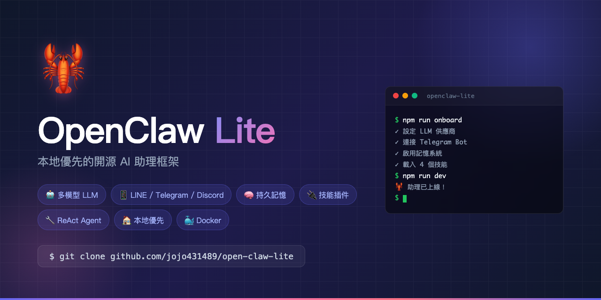

# 🦞 OpenClaw Lite



[](https://opensource.org/licenses/MIT)
[](https://nodejs.org/)
[](https://www.typescriptlang.org/)
[](https://www.docker.com/)
[](https://github.com/jojo431489/open-claw-lite/pulls)

**受 OpenClaw 啟發的開源本地 AI 助理框架**

一個模組化、可擴充的個人 AI 助理，支援 LINE、Telegram、Discord 多平台通訊整合，具備記憶系統、技能插件系統，以及 ReAct 風格的工具呼叫代理。

> 🌟 **本地優先** | 🔒 **隱私可控** | 🔌 **可擴充** | 🌏 **繁體中文友善**

---

## 🎬 5 分鐘快速體驗

```bash
# 1. Clone & Install
git clone https://github.com/jojo431489/open-claw-lite.git
cd open-claw-lite
npm install

# 2. 互動式設定（會引導你填 API Key）
npm run onboard

# 3. 啟動
npm run dev

# 4. 打開瀏覽器訪問 http://localhost:3000 開始對話！
```

無需註冊任何雲端服務，所有資料都在你的機器上。

---

## ✨ 核心功能

| 功能 | 說明 |
|------|------|
| 🤖 **多模型支援** | Anthropic Claude、OpenAI GPT、Ollama 本地模型、自訂 API |
| 📱 **多平台通訊** | LINE、Telegram、Discord、內建 WebChat |
| 🧠 **持久記憶系統** | SQLite 儲存，跨對話記住使用者偏好與資訊 |
| 📦 **技能插件系統** | 動態載入/卸載技能，每個技能包含工具與提示詞 |
| 🔧 **ReAct 代理迴圈** | 支援多輪工具呼叫，自主推理與行動 |
| 🏠 **本地優先** | 所有資料存在你的機器上，隱私可控 |
| 🐳 **Docker 支援** | 一鍵部署到任何環境 |

---

## 📁 專案結構

```
open-claw-lite/
├── src/
│   ├── core/
│   │   ├── types.ts        # 核心型別定義
│   │   ├── events.ts       # 事件匯流排 (Pub/Sub)
│   │   ├── llm.ts          # LLM 客戶端 (多供應商)
│   │   └── agent.ts        # 代理核心 (ReAct 迴圈)
│   ├── channels/
│   │   ├── line.ts         # LINE 頻道適配器
│   │   ├── telegram.ts     # Telegram 頻道適配器
│   │   ├── discord.ts      # Discord 頻道適配器
│   │   ├── webchat.ts      # 內建 WebChat UI
│   │   └── index.ts
│   ├── memory/
│   │   └── store.ts        # SQLite 記憶系統
│   ├── skills/
│   │   └── manager.ts      # 技能管理器
│   ├── utils/
│   │   ├── config.ts       # 設定載入
│   │   └── logger.ts       # 結構化日誌
│   ├── index.ts            # 主程式入口 (Gateway)
│   └── onboard.ts          # 互動式設定精靈
├── skills-builtin/
│   ├── system.ts           # 系統工具 (Shell、檔案、計算)
│   ├── memory.ts           # 記憶管理工具
│   ├── web.ts              # 網頁擷取、HTTP 請求
│   └── notes.ts            # 筆記與待辦事項
├── config/
│   └── config.json         # 設定檔
├── data/                   # 執行時資料 (記憶、筆記、日誌)
├── Dockerfile
├── docker-compose.yml
├── .env.example
├── package.json
└── tsconfig.json
```

---

## 🚀 快速開始

### 前置需求

- **Node.js 22+**
- AI 模型的 API Key（任選一個）:
  - Anthropic API Key
  - OpenAI API Key
  - Ollama（本地免費）

### 安裝步驟

```bash
# 1. 複製專案
git clone <your-repo-url> open-claw-lite
cd open-claw-lite

# 2. 安裝依賴
npm install

# 3. 執行設定精靈
npm run onboard

# 4. 啟動！
npm run dev
```

設定精靈會引導你設定：
- AI 模型供應商與 API Key
- 通訊平台（LINE / Telegram / Discord）
- 伺服器端口

### 手動設定

如果偏好手動設定，複製 `.env.example` 為 `.env` 並填入你的設定：

```bash
cp .env.example .env
# 編輯 .env 填入 API Key 和 Bot Token
```

---

## 📱 平台設定指南

### LINE

1. 前往 [LINE Developers Console](https://developers.line.biz/)
2. 建立 Messaging API Channel
3. 取得 **Channel Access Token** 和 **Channel Secret**
4. 設定 Webhook URL: `https://your-domain.com/webhook/line`
5. 在 `.env` 中填入：
   ```
   LINE_CHANNEL_ACCESS_TOKEN=你的Token
   LINE_CHANNEL_SECRET=你的Secret
   ```

### Telegram

1. 與 [@BotFather](https://t.me/BotFather) 對話，建立新 Bot
2. 取得 Bot Token
3. 在 `.env` 中填入：
   ```
   TELEGRAM_BOT_TOKEN=你的Token
   ```

### Discord

1. 前往 [Discord Developer Portal](https://discord.com/developers/applications)
2. 建立 Application，啟用 Bot
3. 開啟 **Message Content Intent**
4. 取得 Bot Token 和 Application ID
5. 用以下 URL 邀請 Bot 到你的伺服器：
   ```
   https://discord.com/api/oauth2/authorize?client_id=你的APP_ID&permissions=274877975552&scope=bot
   ```
6. 在 `.env` 中填入：
   ```
   DISCORD_BOT_TOKEN=你的Token
   DISCORD_APP_ID=你的APP_ID
   ```

### WebChat（內建）

預設啟用，開啟瀏覽器訪問 `http://localhost:3000` 即可使用。

---

## 🧠 記憶系統

記憶系統使用 SQLite 持久化儲存，支援四種類別：

| 類別 | 用途 | 範例 |
|------|------|------|
| `preference` | 使用者偏好 | 喜歡繁體中文、偏好簡潔回覆 |
| `fact` | 使用者事實 | 名字、職業、所在地 |
| `context` | 上下文資訊 | 正在進行的專案、近期事件 |
| `skill` | 學習到的行為 | 使用者的工作流程 |

### 自動記憶提取

當 `memory.autoExtract` 啟用時，每次對話後 Agent 會自動呼叫 LLM 從對話中提取值得記住的資訊。

### 記憶指令

```
/memory    - 查看所有記憶
/forget <key> - 刪除特定記憶
```

---

## 📦 技能插件系統

### 內建技能

| 技能 | 工具 | 說明 |
|------|------|------|
| **system** | `shell_exec`, `file_read`, `file_write`, `file_list`, `get_time`, `calculate` | 系統操作 |
| **memory** | `remember`, `recall`, `forget`, `list_memories` | 記憶管理 |
| **web** | `web_fetch`, `http_request` | 網頁擷取、API 呼叫 |
| **notes** | `create_note`, `read_note`, `list_notes`, `add_todo`, `list_todos`, `complete_todo` | 筆記與待辦 |

### 建立自訂技能

在 `skills-builtin/` 資料夾中建立新的 `.ts` 檔案：

```typescript
import { SkillDefinition, ToolDefinition } from '../src/core/types.js';

const myTool: ToolDefinition = {
  name: 'my_tool',
  description: '我的自訂工具',
  parameters: {
    type: 'object',
    properties: {
      input: { type: 'string', description: '輸入參數' },
    },
    required: ['input'],
  },
  async execute(args, context) {
    // 你的邏輯
    return { success: true, output: `結果: ${args.input}` };
  },
};

const skill: SkillDefinition = {
  name: 'my-skill',
  version: '1.0.0',
  description: '我的自訂技能',
  systemPromptAddition: '你有一個自訂工具可以使用...',
  tools: [myTool],
};

export default skill;
```

重啟後自動載入。

---

## 🏗️ 架構設計

```
┌──────────────┐     ┌──────────────┐     ┌──────────────┐
│   LINE Bot   │     │ Telegram Bot │     │ Discord Bot  │
└──────┬───────┘     └──────┬───────┘     └──────┬───────┘
       │                    │                    │
       └────────────┬───────┴────────────────────┘
                    │
           ┌────────▼────────┐
           │  Message Router │  ← 統一訊息路由
           └────────┬────────┘
                    │
           ┌────────▼────────┐
           │     Agent       │  ← ReAct 推理迴圈
           │  (Brain Core)   │
           └──┬─────┬─────┬──┘
              │     │     │
     ┌────────▼┐ ┌──▼──┐ ┌▼────────┐
     │   LLM   │ │Memory│ │ Skills  │
     │ Client  │ │ Store│ │ Manager │
     └─────────┘ └─────┘ └────┬────┘
                               │
                    ┌──────────▼──────────┐
                    │   Tools (動態載入)   │
                    │ shell, file, web... │
                    └─────────────────────┘
```

### 訊息處理流程

1. **接收** → 頻道適配器收到訊息，轉換為統一格式
2. **路由** → Message Router 分發到 Agent
3. **建構上下文** → 載入系統提示詞 + 記憶 + 對話歷史
4. **推理迴圈** → Agent 呼叫 LLM，LLM 決定是否使用工具
5. **執行工具** → 如需要，執行工具並將結果回傳 LLM
6. **重複** → 最多 10 輪工具呼叫，直到 LLM 產生最終回覆
7. **回應** → 透過原始頻道回傳
8. **記憶** → 非同步提取並儲存記憶

---

## 🐳 Docker 部署

```bash
# 建構並啟動
docker-compose up -d

# 查看日誌
docker-compose logs -f

# 停止
docker-compose down
```

---

## ⚙️ 設定參考

### config.json 完整設定

```jsonc
{
  "botName": "ClawBot",           // Bot 名稱
  "language": "zh-TW",            // 預設語言
  "timezone": "Asia/Taipei",      // 時區

  "llm": {
    "provider": "anthropic",      // anthropic | openai | ollama | custom
    "model": "claude-sonnet-4-20250514",
    "apiKey": "sk-...",
    "baseUrl": "",                // Ollama/自訂 API 才需要
    "temperature": 0.7,
    "maxTokens": 4096
  },

  "channels": {
    "line": {
      "channelAccessToken": "...",
      "channelSecret": "..."
    },
    "telegram": {
      "botToken": "..."
    },
    "discord": {
      "botToken": "...",
      "applicationId": "..."
    }
  },

  "memory": {
    "enabled": true,
    "dbPath": "./data/memory.db",
    "maxEntriesPerUser": 500,
    "autoExtract": true            // 自動從對話提取記憶
  },

  "skills": {
    "enabled": true,
    "directory": "./skills-builtin",
    "autoLoad": true
  },

  "server": {
    "port": 3000,
    "webhookUrl": ""               // LINE webhook 用
  },

  "security": {
    "allowedUsers": [],            // 空 = 允許所有人
    "adminUsers": [],
    "requireApproval": false       // 危險操作需要確認
  }
}
```

---

## 📋 可用指令

在任何頻道中輸入：

| 指令 | 說明 |
|------|------|
| `/help` | 顯示指令列表 |
| `/skills` | 列出已載入的技能 |
| `/memory` | 查看記憶 |
| `/forget <key>` | 刪除特定記憶 |
| `/clear` | 清除對話歷史 |
| `/status` | 系統狀態 |

---

## 🔒 安全注意事項

- `shell_exec` 工具已封鎖危險指令（如 `rm -rf /`）
- 建議在 `security.allowedUsers` 中設定允許的使用者
- 生產環境建議啟用 `security.requireApproval`
- LINE webhook 應使用 HTTPS
- 所有 API Key 應透過環境變數設定，不要寫在程式碼中

---

## 🆚 與 OpenClaw 的比較

| 特性 | OpenClaw | OpenClaw Lite |
|------|----------|---------------|
| 語言 | TypeScript | TypeScript |
| 通訊平台 | 15+ | 4 (LINE, Telegram, Discord, WebChat) |
| LLM 支援 | 5+ 模型 | 4 (Claude, GPT, Ollama, Custom) |
| 記憶系統 | ✅ | ✅ |
| 技能系統 | ✅ (3000+ 社群) | ✅ (可擴充) |
| Heartbeat | ✅ | ❌ |
| 語音互動 | ✅ | ❌ |
| Dashboard | ✅ | WebChat UI |
| 複雜度 | 高 | 低（易於理解和修改）|

---

## 🤝 貢獻

歡迎 PR、Issue、討論！

- 🐛 **回報 Bug**：[開新 Issue](https://github.com/jojo431489/open-claw-lite/issues/new)
- 💡 **功能建議**：[Discussions](https://github.com/jojo431489/open-claw-lite/discussions)
- 🔧 **提交 PR**：Fork → 修改 → 發 PR

特別歡迎這些貢獻：
- 新增技能插件（在 `skills-builtin/` 下）
- 新增通訊平台整合（Slack、Discord 改進等）
- 翻譯（簡中、English、日本語）
- 教學文件、影片

---

## ⭐ Star History

如果這個專案對你有幫助，給個 Star 鼓勵一下！

[](https://star-history.com/#jojo431489/open-claw-lite&Date)

---

## 📄 授權

[MIT License](LICENSE) - Copyright (c) 2026 Bo Cheng Tian (田柏程)

可自由使用、修改、商業使用，唯一要求保留著作權聲明。

---

## 🙏 致謝

- 受 [OpenClaw](https://github.com/openclaw) 啟發
- 使用 [Anthropic Claude](https://www.anthropic.com/) / [OpenAI](https://openai.com/) / [Ollama](https://ollama.com/) 提供 AI 能力
- LINE / Telegram / Discord 平台 SDK

---

## 📬 聯絡

- **作者**：田柏程 (Bo Cheng Tian)
- **GitHub**：[@jojo431489](https://github.com/jojo431489)
- **LinkedIn**：[bochengtian](https://www.linkedin.com/in/bochengtian)
- **個人網站**：[BCTech 製造業顧問](https://consulting-site-orcin.vercel.app)

---

🦞 **Happy Hacking!** 如果遇到任何問題，歡迎開 Issue 或聯絡我。
